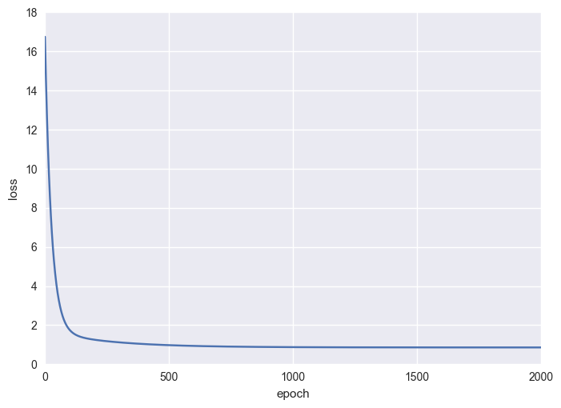

# Linear Regression - A Toy Example

## Generate Data


```python
import numpy as np
import matplotlib.pyplot as plt

plt.style.use('classic')
plt.style.use('seaborn')

N = 100
lr = 1e-3
```


```python
# Generate linear data in 1-dim
X = np.random.normal(0, 3, (N, 1))  # x's
noise = np.random.randn(N, 1)  # incur Gaussian noise for target value
y = 1 + X + noise  # y's, a straight line: y = 1 + x

plt.scatter(X, y)  # plot data points
plt.show()
```


### Train with Gradient Descent


```python
# Define model which is just a weight matrix
W = np.random.randn(1, 1)
b = np.zeros((1, 1))

# Predict
y_pred = X.dot(W) + b

# Compute loss
L = np.power(y_pred - y, 2).mean()
```


```python
# Compute the analytic gradient of W and b
dy_pred = 2* (y_pred - y)/ N
dW = X.T.dot(dy_pred)
db = dy_pred.sum(axis=0, keepdims=True)
```


```python
# Parameter update
W -= lr * dW
b -= lr * db
```

## Putting It All Together


```python
# Putting it all together. Train on batch
loss = []  # record loss

for epoch in range(2000):
    
    # Forward pass
    y_pred = X.dot(W) + b
    
    L = np.power(y_pred - y, 2).mean()
    loss.append(L)
    
    # Compute the gradient of W and b
    dy_pred = 2* (y_pred - y)/ N
    dW = X.T.dot(dy_pred)
    db = dy_pred.sum(axis=0)
    
    # Parameter updata
    W -= lr * dW
    b -= lr * db
        
# Print loss & model
print(round(L, 2))
print('W:', round(W[0][0], 2))
print('b:', round(b[0][0],2))

```

    0.86
    W: 1.03
    b: 0.92


```python
# Plot loss function
plt.plot(loss)
plt.ylabel('loss')
plt.xlabel('epoch')
plt.show()
```





```python
X_min = X.min(axis=0) - 2
X_max = X.max(axis=0) + 2
mx = np.linspace(X_min, X_max)
my = mx * W[0][0] + b[0][0]
print(W[0][0])
print(b[0][0])

# Plot
plt.scatter(X, y)
plt.plot(mx, my, c='red', linestyle='dashed', linewidth=2)
plt.xlabel('x')
plt.ylabel('y')
plt.show()
```

    1.03368735009
    0.917743622157


