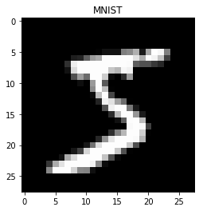

# Classifying MNIST with Feedforward, Recurrent and Convolutional Neural Networks

***

1. 簡介：這篇文章要做什麼。
2. 原理：
   - 依照解決問題的脈絡陳述重要部分（解釋原理、數學），可以在前面加一些概略性的介紹，以這篇而言就是 MNIST dataset 的介紹。
3. Code
   - 依照程式順序（應與原理部分的結構大致相同）

Code structure: 

1. 前面都一樣
2. Define 3 types of networks using PyTorch.

2. 到 mini-batch sampling 時利用取出的 mini-batch 同時訓練三種 network。
3. 最後展示三種模型的 training/test accuracy。

***

This will be a post on classifying the MNIST dataset with different architectures of neural network.

 

*Dataset.*

**MNIST**

1. Stands for "Modified National Institute of Standards and Technology".
2. Containing grey-scale images of hand-written digits ranging from 0 to 9.
3. Each image is of size 28x28 (widthxheight).
4. Training set of size 60,000 and test set of size 10,000. It's common to split data into 50,000 training data and 10,000 validation data.

 

*Architecture.*

1. **Feedforward Neural Network (FNN)**

   ​

   

   **This image is taken from [here]().*

   ​

   - Two-layered neural network
   - 128 hidden units with ReLU activation
   - Note the weight matrix for the hidden layer is rather large, since the image needs to be flatten into an one-dimensional array of size 784 (=28x28). Hence the weight matrix is of size 784x64=50,716.

2. **Recurrent Neural Network (RNN)**

   A special kind of RNN we are considering here is the *LSTM* networks.

   ​

   

   **This image is taken from [here]().*

   ​

   - Single-layered LSTM + output layer
   - 128 hidden units
   - Only feed the output of the LSTM layer at the last time-step to the output layer to produce final output.

3. **Convolutional Neural Network (CNN)**

   ​

   

   **This image is taken from [here]().*

   ​

   [details goes here...]

   ​

We implement the networks and training algorithm using `PyTorch`, Facebook's deep learning library. The same training procedure will be carried out for each neural network and training conditions will be fixed across each model for a meaningful comparison (although the model complexity, i.e. number of parameter in a model, is very different).

The other point we will stress in this post is *data preprocessing* which is the crucial part of the training procedure. Standard data preprocessing procedure for image data is illustrated below (this part is taken from the Stanford CS231n [class note](http://cs231n.github.io/neural-networks-2/)).

 

*Data Preprocessing.*

> A training example from the MNIST dataset.

1. **Mean Substraction.** For each training example, we substract the mean  across every *feature* in the data. It has the geometric meaning of centering the data at zero along every dimension.  For image data, we substract the mean of pixel values; it's common to substract a single value from all pixels (3 channels) or to do so separately for each channel.
2. **Normalization.** The procedure refers to normalizing the data to approximately the same scale. Here we take the approach that dividing data by the standard deviation calculated across each feature. Another possible approach is to normalize the data such that the min and max along each dimension is -1 to 1 (say, by taking the tanh function).

For example, suppose we are using numpy. Let `X` be the data matrix of shape `[N, D]`, where N is the number of training examples each with dimension D. Then the mean substraction will simply be `X -= X.mean(axis=0)` and the normalization would be `X /= X.std(axis=0)`.

In PyTorch, data preprocessing can be done very easily with methods from `torchvision.transforms` as we will see in the code.

 

*Code.*

1. Libraries and Hyper-parameters
2. Loading Dataset and Data Preprocessing
3. Network, Loss and Optimizer
4. Training
5. Evaluation