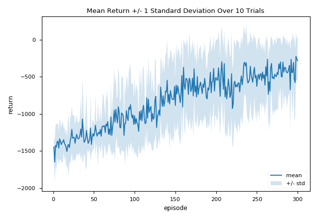
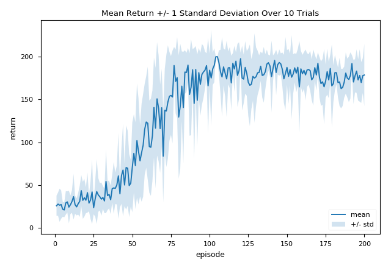
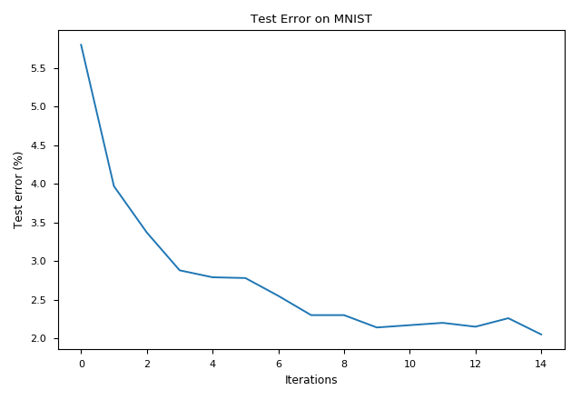
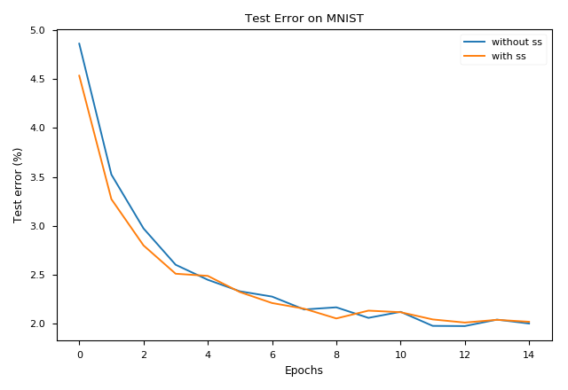

# Thirsty Scholar's Deep Thinking

This repo contains the following materials:

## Deep Deterministic Policy Gradient (DDPG)

A simple implementation of the *deep deterministic policy gradient* algorithm presented in [this paper](https://arxiv.org/pdf/1509.02971.pdf) on the classical [Pendulum task](https://github.com/openai/gym/wiki/Pendulum-v0) via [OpenAI Gym](https://gym.openai.com). The resulting learning curve is shown below.

I also standardized the state input by keeping a running stat (taken from [John Schulman's repo](https://github.com/joschu/modular_rl/blob/master/modular_rl/running_stat.py)) and scale the reward signal into the range roughly between [-1, 0] by dividing it by 16.

## Proximal Policy Optimization (PPO)

A simple implementation of the single-threaded version of the *proximal policy optimization* algorithm with the clipped surrogate objective in [this paper](https://arxiv.org/abs/1707.06347) by OpenAI. The learning curve on the classical [CartPole](https://github.com/openai/gym/wiki/CartPole-v0) task is shown below.

I also standardized the state input by keeping a running stat (taken from [John Schulman's repo](https://github.com/joschu/modular_rl/blob/master/modular_rl/running_stat.py)) and slightly modified the reward function to make it more suitable for learning.

## Bayes by Backprop (BBB)

An implementation of the *Bayes by Backprop* algorithm presented in the paper ["Weight Uncertainty in Neural Networks"](https://arxiv.org/abs/1505.05424) on the MNIST dataset using PyTorch. Here we use a scaled mixture Gaussian prior.

As you can see on the plot, bayes by backprop prevents the optimization from overfitting. The last test error was around 2.5% after 15 epochs of training.

My implementation differs from the one described in the paper in the following ways:

1. Use exponential function instead of *softplus* for transforming the standard deviation, found to work equally well.

2. Instead of sampling Gaussian noise at every step (which can be very slow), we instantiate a huge block of Gaussian noise at the begining and sample from it.

   \*This means the Gaussian noise sampled are not strictly indenpendent, but didn't find it to be an issue.

3. Use a *symmetric sampling* technique to reduce variance. That is, we always sampling paired Gaussian noise which differ only by a negative sign. Since doing so added some complexity in the code, I saved it to another file: `bayes_by_backprop_ss.py`.

Here is a comparison between using and not using symmetric sampling. To make it a fair fight, we take 2 samples from the posterior when we not using symmetric sampling.

Test error with and without symmetric sampling are around 2.2%, respectively. With symmetric sampling, learning converges faster but the untimate result is similar to their random sampling counterpart.

## BBQ-Networks

Implement the Bayes-by-Backprop Q-network (BBQ-Networks) from [BBQ-Networks: Efficient Exploration in Deep Reinforcement Learning for Task-Oriented Dialogue Systems](https://arxiv.org/abs/1711.05715). We examine BBQ-Networks on the classical mountain car task which the reward is sparse and delayed.

