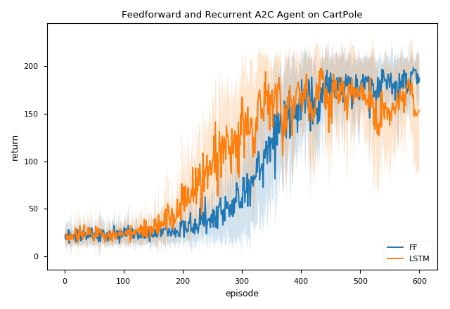
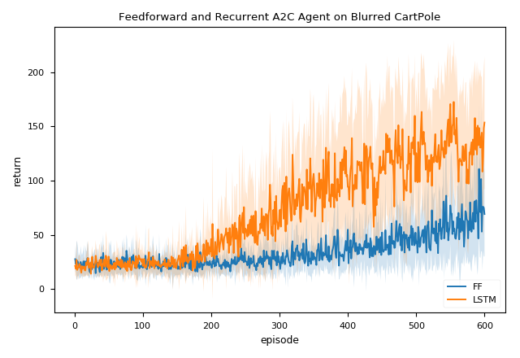
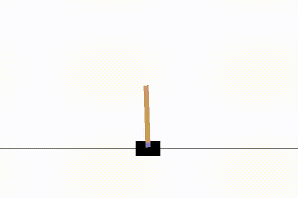
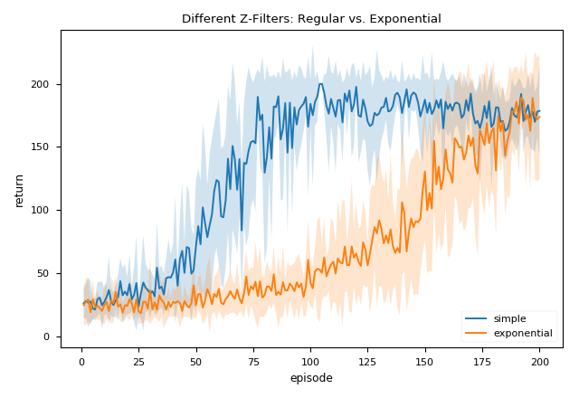

# Thirsty Scholar's Deep Thinking

This repo contains the following materials:

## Advantage Actor-Critic (A2C)

We trained a feedforward and recurrent (LSTM) neural network to solve the CartPole task. For the original version of the task, both network should work equally well as the state representation is Markovian (MDP) (while LSTM takes a lot longer to train.)

To make the state non-Markovian (hence a *POMDP*), we "blurred" the state by randomly setting some of the features to zero at a fixed probability, (namely, a probability *mask*). LSTM agent can still learn a good policy although not as good the one in the Markovian case since we set the probability faily high at 30%.

## Deep Deterministic Policy Gradient (DDPG)

A simple implementation of the *deep deterministic policy gradient* algorithm presented in [this paper](https://arxiv.org/pdf/1509.02971.pdf) on the classical [Pendulum task](https://github.com/openai/gym/wiki/Pendulum-v0) via [OpenAI Gym](https://gym.openai.com). The resulting learning curve is shown below. I also standardized the state input by keeping a running stat (taken from [John Schulman's repo](https://github.com/joschu/modular_rl/blob/master/modular_rl/running_stat.py)) and scale the reward signal into the range roughly between [-1, 0] by dividing it by 16.

## Proximal Policy Optimization (PPO)

A simple implementation of the single-threaded version of the *proximal policy optimization* algorithm with the clipped surrogate objective in [this paper](https://arxiv.org/abs/1707.06347) by OpenAI. The learning curve on the classical [CartPole](https://github.com/openai/gym/wiki/CartPole-v0) task is shown below. I also standardized the state input by keeping a running stat (taken from [John Schulman's repo](https://github.com/joschu/modular_rl/blob/master/modular_rl/running_stat.py)) and slightly modified the reward function to make it more suitable for learning.

**Update:** I upload another file on applying PPO to the Atari games in `ppo_atari.py`. For the sake of simplicity, I train the agent using the *128 ram input* of the Atari machine. Main differences:

1. Scale the input feature by 255.
2. Reduce action space (for some games).
3. Scale the reward fucntion (for some games).

But the main architecture remains the same.

### Experiments with Different Z-Filters

Play with different z-filters: one is the simple mean and standard deviation and the other is the exponential-weighted mean and standard deviation.

## Bayes-by-Backprop Q-Networks (BBQ-Networks)

Implement the Bayes-by-Backprop Q-network (BBQ-Networks) from [BBQ-Networks: Efficient Exploration in Deep Reinforcement Learning for Task-Oriented Dialogue Systems](https://arxiv.org/abs/1711.05715). We examine BBQ-Networks on the classical mountain car task which the reward is sparse and delayed.

## Variational Information Maximizing Exploration (VIME)

