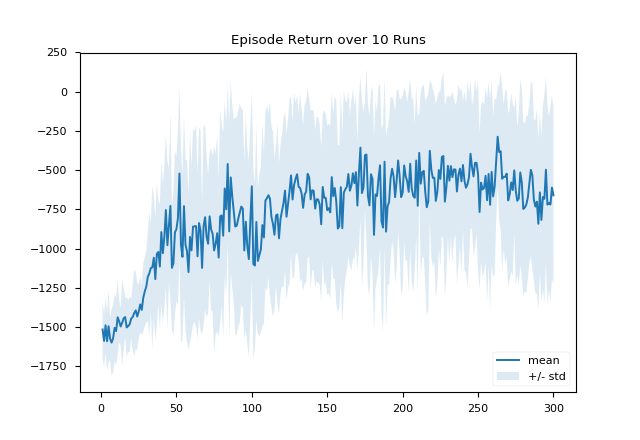

# Thirsty Scholar's Deep Thinking

The repo contains the following material:

## Deep Deterministic Policy Gradient (DDPG)

A simple implementation of the *deep deterministic policy gradient* algorithm presented in [this paper](https://arxiv.org/pdf/1509.02971.pdf) on the classical [Pendulum task](https://github.com/openai/gym/wiki/Pendulum-v0) via [OpenAI Gym](https://gym.openai.com).

