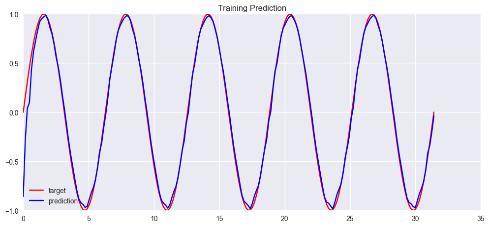

## Regression with RNNs

In this post, we discripe a series of post on training various recurrent neural networks for a simple regression task: to predict the value of $\sin(t)$ with $\cos(t)$. For most networks discussed in this post, we can use the `nn.RNN` or `nn.LSTM` module to conveniently build up our model, but we take a different way: try to build the network by directly inherently the  `nn.Module` class. This gives us the maximal flexibility to build the network we want (some may look very strange and I built them just for fun!)

#### Mini-batch Sampling

Another important point is the mini-batch training the RNNS. Unlike non-recurrent (feedforward and convolutional ones alike), the mini-batch must be sampled in *sequence*, since the RNN takes in the input time-step by time-step. Also, to prepare the hidden state for mini-batch training, we sample a longer sequence, say of length $m+k$ and do a full forward pass but only backpropapage for the last $k$ steps (the first additional $m$ steps is prepare the hidden state).

#### Jupyter Notebooks

We do 5 experiments on the same tasks. Since the task is quite a simple one, there is no apparent differences. But it's fun to build the network layer by layer and see them working. All code and results can be found in the 5 jupyter notebooks in my [github](). 

### Data

Data preparation is easy, we linear separate the interval $[0, 10\pi]$ into 200 points and take thier $\cos(t)$ and $\sin(t)$ value. For simplicity, we don't add any noise in the data.

### Model

**Nb 1:  Elman Netowrk.** The *Elman network* is a single-layered hidden-to-hidden recurrent neural network. The idea is to take the output of the hidden layer from the last time-step (so-called hidden state); delayed it for a time-step and re-input it to the hidden layer at the next time-step. 

*Implementation Trick.*

To implement the recurrent structure, we add a linear layer (without activation functions) to the output of the hidden layer. The linear layer will take in the output of the hidden layer and the resulting output of the linear layer will then be added to the current input to be fed into the hidden layer together.

Another approach is to *concatenate* the output of the hidden layer to its input, but I found the first solution to be much easier to implement and more elegent.

**Nb 2:  Two-Layered Elman Network.** In this notebook we go "deeper" to consider the two-layered Elman network. Everything stays the same except we now have to keep track of two hidden states (since we have two recurrent layers).

**Nb 3:  Jordan Network.** There is another classical RNN structure called the Jordan network. Unlike Elman networks have loop on the hidden layer, the Jordan network have loop on the final *output* of the network. The output from the last time-step is re-fed into the hidden layer at the next time-step. Such network can be less powerful due to the fact that the output along doesn't carry much information like the hidden state does. As we will see in the notebook, the result is not as successful as the one we obtain using the Elman network.

**Nb 4:  Hybrid Network.** This network is a little different from the previous ones (actually I built this network just for fun). This network had multiple structures, both recurrent and feedforward. It combines the above two recurrent networks, both the Elman and the Jordan network. There is an additional feedforward structure - directly takes the input to the output layer. This is accomplished by adding an linear layer connecting the input and the output layer. The reason to do so is that I want the network to have the ability to bypass the information to go into the recurrent layer. An interesting experiment I want to conduct on the network behavior under this kind of structure.

**Notebook 5 LSTM Network.** This notebook is much more standard, using the famous LSTM network (may be an over-kill for this task!). Again we implement the LSTM by directly inherenting the `nn.Module` class. The number of parameter in a LSTM network is much more than a standard RNN, so it needs more epochs of training and it's expected that it would fit the data perfectly.

All model contains the same number of hidden units and hyper-parameters are fixed across all model. The difference lays in the model structure and the number of parameters in the model. Although model with more parameters needs more epochs of training, we fixed 200 epochs of training in all cases.

### Conclusion

The result is evident: two-layered Elman net, hybrid net and LSTM performed well. It is expected as they have much more parameters in the model hence coms with better representation power. The Jordan network performs surprisingly bad (I double-checked the code, no error) and doesn't seem to capture the wave-shape curve at all.

