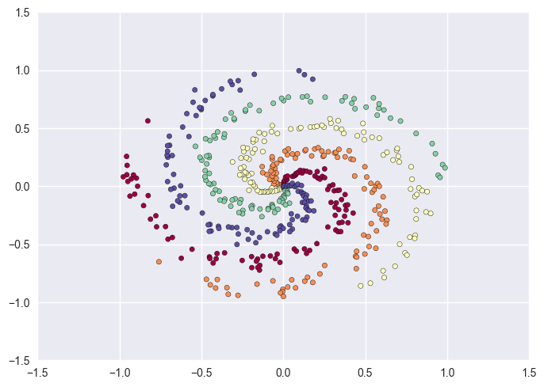
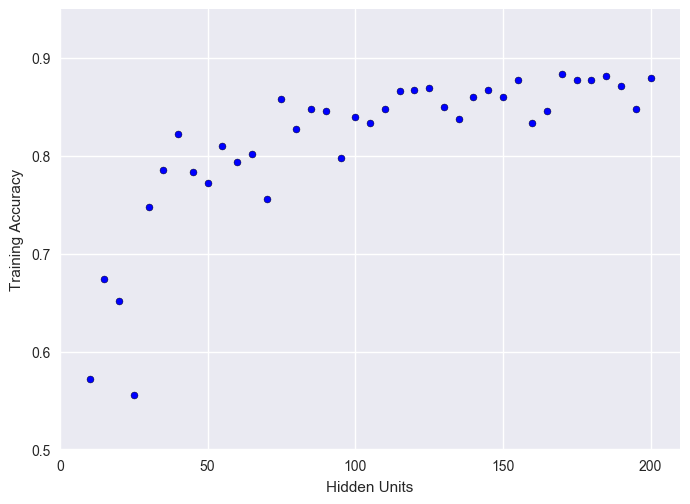
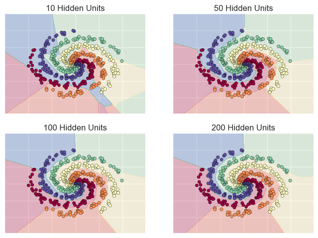

# From Scratch: Training a Neural Network to Classify Spiral Datasets


*Table of Content.*

[TOC]

<br><br>

## Introduction

This example was taken from the Stanford CS231n [class note](). The original one was to train a two-layered neural network to classify a 3-spiral dataset. I extend the example in various ways and modify the code to be consistent with notations from my previous [post]() on backpropagation.

​	The article is structured as follows: first we explain how to generate spiral datasets for more than 3 spirals; various plots are provided for visualization. Second, we provide a complete example on how to train a two-layered neural network to classify the 5-spiral dataset generated from the first section. Training accuracy and decision boundary of the resulting classifier are provided. Results for 3, 4 and 6-spiral dataset are also provided for comparison. In the third section we focus on the 5-spiral dataset and test the *representation power* of our model in the sense of the number of hidden units. We decrease the number of hidden units in the network and see how the training accuracy varies. A scatter plot is provided to demonstrate the relation between training accuracy and the number of hidden units. We also plot the resulting decision boundaries for various hidden units.


<br>

## How to generate N-spiral datasets?

<br>

> A 5-spiral dataset.
>
> 


Since the dataset is spiral, it's natural to consider polar coordinates with radius growing gradually from 0 to 1. The key observation lays in the angle: to generate a "nice-looking" N-spiral dataset , the angle for each spiral should take up to **$\frac{N-1}{N}2\pi$**. That is, the arc length of each sprial should cover approximately $\frac{N-1}{N}$ circumference of the unit circle if we image that the spiral being "pushed" onto the circumference. On the direction of the spiral; the spiral will rotate clockwise if you use the following parametrization
$$
x = r\sin(\theta), y = r\cos(\theta).
$$
Interchaging $x$ and $y$ will cause the spiral to rotate counter-clockwise.

​	With the above observations in mind, we can generate the N-spiral dataset for any N. The original CS231n class note uses a 3-spiral dataset for a classification problem. To add more complexity, we will classify a 5-spiral dataset. More than 6 spirals will cause the graph to be too crowded to visualize.


> Some spiral datasets.
>
> 


<br>

## A complete example

In this section we provide a complete example on training a two-layered nueral network to classify the 5-spiral dataset generated above with backpropgation. The network contains 100 hidden units and uses softmax function as output. Cross-entropy loss fucntion is used.


> Network architecture.
>
> 


​	We train the network *on batch*. That is, each update we make use of the entire dataset. Batch training method can be most naturally expressed in *matrix-form*. The math of backpropagation (not covered  here) is somewhat difficult to comprehend for people who are not already familiar with matrix calculus. I also wrote a post on backpropagation of a two-layered neural network; working out all the math you need to know to understand the code below. You can find it [here]().


​	Here we begin to build our neural network in code. Although it may sound mysterious, but defining a neural network in essense is just defining a collection of weights, biases and selecting an activation function. It can be realized easily as follows:

```python
# Number of hidden units
h = 100

# Weights and biases for each layer
W1 = np.random.randn(D,h)*1e-2
b1 = np.zeros((1,h))

W2 = np.random.randn(h,K)*1e-2
b2 = np.zeros((1,K))
```

​	Note we initialize the weight from a standard normal distribution and set all the biases to zero. This is a common way to initialize a neural network: initializing the weights to be small numbers with approximately half positive, half negative and the bias terms to zero.

​	Once we have the network, we can perform *forward-propagation* to compute the output and the loss to evaluate the quality of our output. The network outputs a softmax function, the normalized exponential-weighted values, over all possible outputs. They serve as a likelihood: the higher of the output value is for a certain label, the more likely the network thinks it is the correct answer.

```python
# Hidden layer
Y1 = X.dot(W1) + b1
H1 = np.maximum(Y1, 0)  # ReLU

# Output layer
Y2 = H1.dot(W2) + b2

# Softmax
exp_Y2 = np.exp(Y2)
softmax = exp_Y2 / exp_Y2.sum(axis=1, keepdims=True)
```

​	Since the softmax output can be viewed as a *multinomial distribution* over labels, it's most natural to use the *cross-entropy loss* to evaluate the output. Cross-entropy quantifies difference between two probability distributions on the same random variable. The intuition is that we want the output distribution over labels to be as close to the "true" data distribution as possible conditioned on the input data. Note that we add a regularization term to the loss function to capture the loss of model-complexity: larger weights contribute to large model-complexity. L2 regularization (the one we use here) is the most common one used in pracctice and has the effect of "diffusing"  weights to each input feature.

```python
# Cross-entropy loss
Loss_i = -np.log(softmax[range(N),y])
data_loss = Loss_i.mean()

# L2 regularization loss
reg_loss = 0.5* reg* (np.sum(W1**2)+ np.sum(W2**2))

# Total loss = data loss + regularization loss
Loss = data_loss + reg_loss
```

​	Once the forward-propagation is complete, we can now propagate the loss *backward* through the neural network (so-called "backpropagation"). Backpropagation is just another way of saying to compute the gradient of the loss function with respect to each model parameter: every weight and every bias of every layer.

```python
# Backprop in the following order:
#	dY2 -> dW2, db2, dH1 -> dY1 -> dW1, db1

# dY2
dY2 = softmax
dY2[range(N),y] -= 1
dY2 /= N

# dW2 & db2
dW2 = H1.T.dot(dY2)
db2 = dY2.sum(axis=0, keepdims=True)

# dH1
dH1 = dY2.dot(W2.T)

# dY1
dY1 = dH1* (Y1 > 0)

# dW1 & db1
dW1 = X.T.dot(dY1)
db1 = dY1.sum(axis=0, keepdims=True)

# Add up regularization losses
dW2 += reg* W2
dW1 += reg* W1
```

​	The final step of the training process is parameter update. We nudge parameters a little bit toward the gradient direction to (hopefully) decrease the loss. `lr` is the *learning rate*, also called step size, is a hyper-parameter that can be chosen through cross-validation.

```python
W1 -= lr* dW1
b1 -= lr* db1
W2 -= lr* dW2
b2 -= lr* db2
```

​	Of course, the training process will not stop for one *epoch*, a term that indicates a complete round of training. It may take hundreds or thousands more epoches for the network to converge to a local minimum. Below is the training accuracy and the decision boundary of training the neural newtork for 5,000 epoches:


$$
\text{Training Accuracy: }82\%
$$
<br>


​	I also trained the neural network for 3, 4 and 6-spiral datasets. Training accuracies are
$$
\begin{align}
\text{3 spiral: } &96\%\\
\text{4 spiral: } &93\% \\
\text{5 spiral: } &88\%\\
\text{6 spiral: } &76\%.\\
\end{align}
$$
The result quite fits our intuition: complex data challenges the model's *representation power*

and decreases the training accuracy. Also, the training accuracy varies for the 5-sprial dataset (the dataset shown in the subplot is re-generated, different from the one above). There are two possible reasons: 1. randomness in generating the data, maybe the randomness is not as high as the first 5-spiral dataset. 2. Model parameters are also generated randomly. Maybe we "get lucky" and start off from a better initialization, making it easier to minimize the loss.

<br>

> Decision boundaries for various spiral dataset.
>
> 


<br>

## Representation power for N=5

Here we test the representation power of the neural network by varying the number of hidden units. It's expected that decreasing the number of hidden units will cause the training accuracy to drop.

<br>

> Relation between the number of hidden units and training accuracy. 

​	

​	We plot the decision boundary for various hidden units so that we can visualize the effect of decreasing them. Training accuracies are
$$
\begin{align}
\text{10 hidden units: } &55 \%\\
\text{50 hidden units: } &81 \% \\
\text{100 hidden units: } &87 \%\\
\text{200 hidden units: } &88 \%.\\
\end{align}
$$
The results show that the representation power of 10 hidden units are not sufficient for classifying a 5-spiral dataset. The decision boundary is messing and the network doesn't seem to capture the nature of the spiral-shape in the data. Things get a lot better (but never breach 90% accuracy) when we increase the number of hidden units to 50 and the decision boundary doesn't seem to change much since then. It is also a problem for feed-forward networks: the representation power saturates, increasing the number of hidden units (a source of model-complexity) doesn't result in an proportional increaing in training accuracy.

<br>

> Decision boundaries for network with various hidden units.
>
> 


<br>

## Conclusion

In this post we discuss the following:

1. How to generate the spiral dataset.
2. A complete example on how to train neural nets to classify them from scratch.
3. Play with the number of hidden units in a neural network to test the representation power.


​	Further extension is possible. For example, increase hidden layers in the network, making it a *deep neural network*. This will further increase the representation power and possible enhence the training accuracy. Secondly, we can add validation and testing into the example to make it complete. Here we merely training the nerual network and examine its accuracy on *training set*. There is no way we can find out how these nets will do on unseen, *test* data points. Also, hyper-parameters like the learning rate can be chosen through cross-validation to select the best model.

