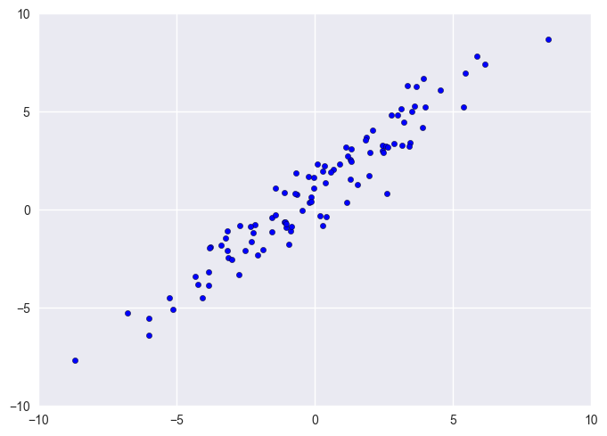
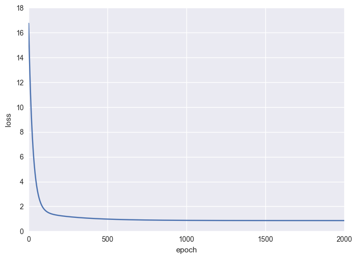
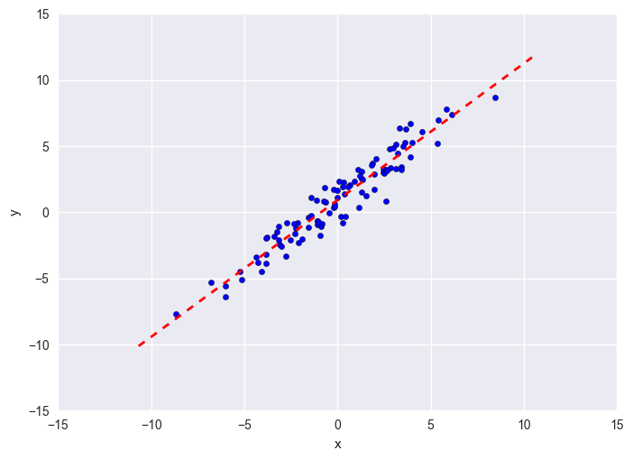

# Linear Regression From Scratch: A Toy Example


*Table of Contents.*

[TOC]

<br>

This quick post uses a toy example to demonstrate how to train a linear regression model using gradient descent. Structured as follows: first we generate a one-dimensional data and define the model (a linear function). Second we state the mathematical result and code implementation of gradient descent. Detailed derivation on the derivavtives will not be included. You can check out my other [post]() on backpropagation for detailed discussion. Third we post the complete code for training a linear regression model with gradient descent. At the last two sections we gives the result of the model and conclude the post.


<br>

## Generate Data / Define Model

For this toy example, we generate a dataset of size 100. The data point is generated  by adding a small Gaussian noise to the straight line $y= x + 1$. Points on the x-axis are also drawn from a Gaussian with mean 0, standard deviation 3.


```python
# Generate linear data in 1-dim
X = np.random.normal(0, 3, (N, 1))  # x's
noise = np.random.randn(N, 1)  # Gaussian noise
y = 1 + X + noise  # y's, a straight line: y = 1 + x
```





​	The model is quite simple since it's linear and one-dimensional. We just have a weight (slope) and bias (intercept), both being a scalar value. For simplicity, we initialized to weight with a standard normal distribution and set the bias to zero. (The reason I used the term weight and bias here is that training a linear regression model is equivalent to training a single *neuron* with linear activation.)


```python
# Model: weight & bias
# Although they are scalars, it's convenient (in programming sense) to view them as 1x1 matrices.
W = np.random.randn(1, 1)
b = np.zeros((1, 1))
```


<br>

## Gradient Descent

To perform gradient descent, we must first forward pass the model to obtain the predicted value and compute the loss function. For regression problems, mean squared error (MSE) loss function is the most commonly-used; defined as
$$
L = \frac{1}{N} \sum_{j=1}^N(\hat y_j - y_j)^2 \,.
$$

```python
# Compute model output and loss
y_pred = X.dot(W) + b
L = np.power(y_pred - y, 2).mean()
```

​	

​	We follow the steps of training a neural network by backpropagating the loss. Hence we first need to compute the gradient of the loss function with respect to model output. Direct computation gives
$$
\frac{\partial L}{\partial \hat y} = 2(\hat y - y) \,.
$$
Now we are ready to backpropagate the gradient to $W$ and $b$. If you are familiar with matrix calculus, the derivation of the gradient should be immediate. Here we give the results directly,
$$
\begin{align}

& \frac{\partial L}{\partial W} = X^T \frac{\partial L}{\partial \hat y} \\
& \frac{\partial L}{\partial b} = \sum_0 \frac{\partial L}{\partial \hat y} \,.\\

\end{align}
$$
We use a summation sign with a zero below it to denote *summing over columns* of the gradient. (This is equivalent to summing along *axis 0* of an array in Numpy and it's the reason I adopt this notation.)

​	Once we have the gradients, we can perform a parameter update on $W$ and $b$. This procedure includes a hyper-parameter called *learning rate*. We arbitrarily fix it to be 1e-3; in practice, we can choose its value via cross-validation.


```python
# Compute the analytic gradient of W and b
dy_pred = 2* (y_pred - y)/ N

dW = X.T.dot(dy_pred)
db = dy_pred.sum(axis=0, keepdims=True)  # note the similarity between the code and the summation symbol I used above

# Parameter update
lr = 1e-3

W -= lr * dW
b -= lr * db
```


<br>

## Training with Gradient Descent

In the last section, we saw how the training works for one *epoch*. In training model with iterative methods like gradient descent, one epoch is far from enough. So we will train the model for, say 2,000 epochs. Repeating the training procedure is simple enough: just adding a for-loop up front.


```python
for epoch in range(2000):
    
    # Forward pass
    y_pred = X.dot(W) + b
    L = np.power(y_pred - y, 2).mean()
    
    # Compute the gradient of W and b
    dy_pred = 2* (y_pred - y)/ N
    dW = X.T.dot(dy_pred)
    db = dy_pred.sum(axis=0)
    
    # Parameter updata
    W -= lr * dW
    b -= lr * db
```


<br>

## Result

The plot shows the loss curve against the number of epochs. We can see the loss decreases rapidly for the first 100 epochs but slows down since then (being almost a straight line). Note that the loss stops at around 1 but never converges to zero. This is expected since we are fitting a straight line to data generated with a straight line *plus some noise*. Even if we fit the model perfectly (with weight and bias both almost equal to 1), there will still be loss caused by noise in the data.




Model parameters we found after training:
$$
W: 1.0818,\, b=1.0084 \,.
$$
They are very close to the original straight line generating the data. Plot the straight line with the data; we see that we solve the linear regression problem very nicely.




<br>

## Conclusion

In this post we fit a linear regression model to data generated by a straight line plus some noise. We train the model by gradient descent; meaning that we adjust model parameters toward the direction that most decreases the error between the prediction value and the target value. As we saw above, such method may take many iterations to converge. Full code can be found in my [github]() within a Jupyter notebook file if you wanto to reproduce the result.

​	Another method to fit a linear regression model without using iterative methods is to solve the *normal equations*. It uses the notion of projection to solve the minimization problem directly.

